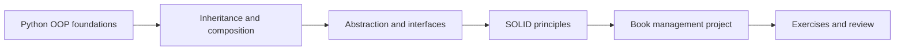
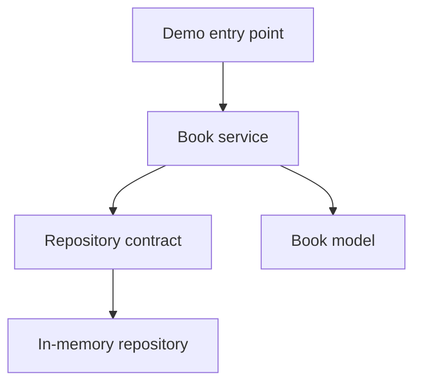

<div align="center">

# 🐍 Advanced Python

### Object-Oriented Design · SOLID Principles · Practical Architecture

[](https://www.python.org/)
[](#getting-started)
[](#learning-path)
[](#verification)

[](https://git.io/typing-svg)

**A code-first learning repository for building strong Python design fundamentals.**

[Explore the examples](examples/) · [Read the OOP guide](docs/01_oop.md) · [Study SOLID](docs/02_solid.md) · [Run the book project](book_project/)

</div>

---

## Why this repository exists

Advanced Python is designed to move from memorizing syntax to understanding design.

Every topic follows the same loop:

```text
Read the idea  →  Run the example  →  Change the code  →  Solve the exercise  →  Review the design
```

The repository focuses on the parts of Python that make real projects easier to extend:

- Object-oriented programming and the four core OOP concepts.
- Inheritance, abstraction, composition, and Python's built-in tools.
- The five SOLID principles with practical “bad design vs better design” examples.
- A small book-management project that connects the concepts together.
- Exercises and separate solutions for deliberate practice.
- Standard-library tests to verify the learning project.

---

## Learning path



| Stage | Focus | Where to start |
|---|---|---|
| 01 | Classes, objects, attributes, methods | [`examples/oop/01_classes.py`](examples/oop/01_classes.py) |
| 02 | Encapsulation and controlled state | [`examples/oop/02_encapsulation.py`](examples/oop/02_encapsulation.py) |
| 03 | Inheritance and method reuse | [`examples/oop/03_inheritance.py`](examples/oop/03_inheritance.py) |
| 04 | Abstraction and contracts | [`examples/oop/04_abstraction.py`](examples/oop/04_abstraction.py) |
| 05 | Composition and dependency relationships | [`examples/oop/05_composition.py`](examples/oop/05_composition.py) |
| 06 | Useful Python object-oriented tools | [`examples/oop/06_python_tools.py`](examples/oop/06_python_tools.py) |
| 07 | SOLID design principles | [`examples/solid/`](examples/solid/) |
| 08 | Applying everything in a small project | [`book_project/`](book_project/) |

---

## OOP at a glance

| Concept | Core question | Practical outcome |
|---|---|---|
| Encapsulation | Who is allowed to change this state? | Safer and more controlled objects |
| Abstraction | What must the object promise? | Clear contracts and replaceable implementations |
| Inheritance | What behavior is genuinely shared? | Reuse where an “is-a” relationship exists |
| Polymorphism | Can different objects respond to the same operation? | Flexible code with fewer conditionals |
| Composition | Which objects should work together? | Looser coupling and easier testing |

The examples intentionally compare inheritance with composition so you can understand when each approach makes sense.

---

## SOLID in one view

| Principle | Main idea |
|---|---|
| **S — Single Responsibility** | A class should have one clear reason to change. |
| **O — Open/Closed** | Extend behavior without repeatedly modifying stable code. |
| **L — Liskov Substitution** | A subtype must behave correctly wherever its base type is expected. |
| **I — Interface Segregation** | Prefer small, focused interfaces over large contracts. |
| **D — Dependency Inversion** | High-level logic should depend on abstractions, not concrete details. |

Each principle has its own executable example in [`examples/solid/`](examples/solid/) and a detailed explanation in [`docs/02_solid.md`](docs/02_solid.md).

---

## The practical project

The [`book_project`](book_project/) package is a deliberately small in-memory book-management system. It demonstrates how the individual lessons fit into an actual application:



The project gives you a place to observe:

- Domain models that represent the data.
- Contracts that describe required behavior.
- A repository responsible for storage.
- A service responsible for application rules.
- Dependency injection through constructors.
- Tests that verify behavior without a database.

Run it with:

```bash
python -m book_project.demo
```

---

## Repository structure

```text
Advanced_Python/
├── book_project/
│   ├── contracts.py          # Abstractions and repository contracts
│   ├── demo.py               # Runnable application demonstration
│   ├── models.py             # Domain models
│   ├── repositories.py       # In-memory data access
│   └── services.py           # Application and business logic
│
├── docs/
│   ├── 01_oop.md             # OOP concepts and explanations
│   ├── 02_solid.md           # SOLID principles in depth
│   └── 03_review.md          # Review questions and answers
│
├── examples/
│   ├── oop/                  # Focused OOP examples
│   └── solid/                # One example per SOLID principle
│
├── exercises/
│   └── README.md             # Practice tasks without the solution first
│
├── solutions/
│   └── README.md             # Guided solutions and design examples
│
├── tests/
│   └── test_books.py         # Standard-library behavior tests
│
└── README.md
```

---

## Getting started

### Requirements

- Python 3.10 or newer.
- Git.
- No third-party packages are required.

### Clone the repository

```bash
git clone https://github.com/zaidmoen/Advanced_Python.git
cd Advanced_Python
```

### Optional: create a virtual environment

#### macOS / Linux

```bash
python3 -m venv .venv
source .venv/bin/activate
```

#### Windows PowerShell

```powershell
py -m venv .venv
.venv\Scripts\Activate.ps1
```

There is nothing else to install. The project uses Python's standard library.

---

## Run the examples

### OOP examples

```bash
python examples/oop/01_classes.py
python examples/oop/02_encapsulation.py
python examples/oop/03_inheritance.py
python examples/oop/04_abstraction.py
python examples/oop/05_composition.py
python examples/oop/06_python_tools.py
```

### SOLID examples

```bash
python examples/solid/01_srp.py
python examples/solid/02_ocp.py
python examples/solid/03_lsp.py
python examples/solid/04_isp.py
python examples/solid/05_dip.py
```

### Book project

```bash
python -m book_project.demo
```

On Windows, use `py` instead of `python` if that is how Python is configured on your machine.

---

## Verification

Run the complete test suite from the repository root:

```bash
python -m unittest discover -s tests -v
```

The tests use Python's built-in `unittest` framework, so no test dependency is needed.

---

## A better study workflow

1. Read the matching explanation in `docs/`.
2. Run the smallest related example.
3. Change one behavior and predict the output before running it again.
4. Solve the related exercise without opening `solutions/`.
5. Compare your design with the solution.
6. Run the tests and explain why the design works.

The objective is not to copy patterns. It is to recognize responsibilities, dependencies, and trade-offs in your own code.

---

## Design principles used in this repository

- Prefer clear names over clever code.
- Keep examples small enough to understand in one sitting.
- Separate domain logic from storage details.
- Depend on contracts when a component needs replaceability.
- Prefer composition when inheritance would create unnecessary coupling.
- Keep exercises separate from their solutions to protect the learning process.

---

## Roadmap

- [x] OOP foundations and executable examples.
- [x] Inheritance, abstraction, and composition.
- [x] SOLID examples and documentation.
- [x] Book-management mini-project.
- [x] Exercises, solutions, and tests.
- [ ] Add decorators and context managers.
- [ ] Add iterators, generators, and custom protocols.
- [ ] Add typing, dataclasses, and structural pattern matching.
- [ ] Add a larger multi-layer project with persistence.

---

## Author

Built and maintained by **[Zaid Moen](https://github.com/zaidmoen)** as a practical Python learning track focused on clean object-oriented design.

If this repository helps you understand OOP or SOLID, consider giving it a ⭐ and using the examples as a starting point for your own experiments.

<div align="center">

### Learn the syntax. Understand the design. Build with confidence.

</div>
