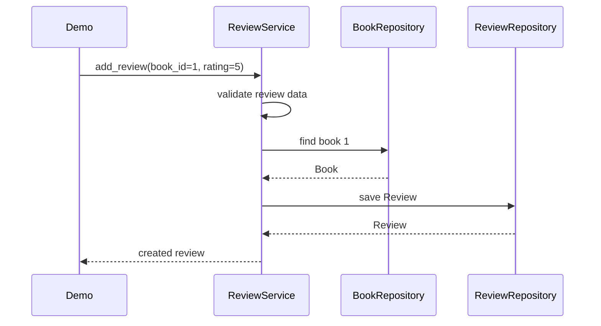

# Book Management Mini-Project

This package is the repository's small integration project. It models books and reviews, stores data in memory, and separates domain rules from storage details through simple contracts.

## Run the demo

From the repository root:

```bash
python -m book_project.demo
```

Expected output:

```text
Average rating: 4.0
Book not found
```

Start reading in this order:

```text
models.py → contracts.py → repositories.py → services.py → demo.py
```

## Request flow

For `add_review(1, 5)`:



If validation fails, or the book does not exist, the review is not stored.

## Domain rules

- Reviews use ratings from 1 through 5.
- Multiple reviews for the same book are allowed.
- There are no users or duplicate-review rules in this learning project.
- The average for a book with no reviews is `None`, not zero.
- The average service does not need to verify that the book exists; it reports review data.
- Data is stored in memory and disappears when the process stops.

## Design map

| Concept | Demonstrated by |
|---|---|
| Encapsulation | Internal repository collections and independent result lists |
| Composition | Services receive repository collaborators |
| Abstraction | Protocols describe the behavior required by services |
| SRP | Models validate data, repositories store data, services coordinate use cases |
| OCP | A new repository can implement the same contract without changing the service |
| LSP | Replacement implementations preserve the existing contract and return semantics |
| ISP | Reading and writing responsibilities are separated where useful |
| DIP | Services depend on contracts; the demo chooses concrete implementations |

## Testing strategy

The project is designed to be tested without a database:

- Repository tests verify storage behavior.
- Service tests can use a small fake repository.
- The service does not need to know whether the repository uses memory, SQLite, or another backend.

Run all tests from the repository root:

```bash
python -m unittest discover -s tests -v
```

## Extending the project with SQLite

To add SQLite later:

1. Implement the existing repository contracts with SQLite-backed classes.
2. Preserve the current behavior and return values.
3. Add focused tests for the new adapter.
4. Change the object composition in `demo.py`.

The services should remain unchanged if the contracts are preserved. That is the practical value of separating policy from infrastructure.
