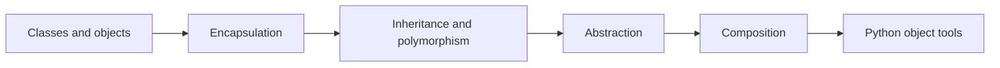

# Object-Oriented Python — A Practical Guide

This guide explains the OOP ideas used throughout the repository. Read a section, run its matching example, then change one behavior and predict the result before executing it again.



## 1. Classes, objects, and `self`

A **class** defines a type. An **object** is a concrete instance of that type.

```python
class Student:
    def __init__(self, name: str) -> None:
        self.name = name

    def describe(self) -> str:
        return f"Student: {self.name}"
```

```python
student = Student("Zaid")
print(student.describe())
```

`__init__` initializes an object after it has been created. `__new__` is responsible for creating the object itself, but most application code does not need to override it.

`self` refers to the current instance. It is a naming convention, not a reserved keyword. When you write `student.describe()`, Python passes `student` to the method as `self`.

Run [`01_classes.py`](../examples/oop/01_classes.py). Predict this before running it: if you add a skill to one student, does another student receive it?

## 2. Instance attributes and class attributes

An instance attribute belongs to one object:

```python
self.name = name
```

A class attribute is shared by instances unless an instance shadows it:

```python
class Student:
    school = "Apex Academy"
```

Avoid mutable class attributes for per-object state:

```python
class Student:
    skills = []  # Shared by every instance: usually a bug.
```

Create the list inside `__init__` instead:

```python
class Student:
    def __init__(self) -> None:
        self.skills: list[str] = []
```

The same warning applies to mutable default arguments such as `skills=[]`. Use `None` or `default_factory` instead.

## 3. Encapsulation

Encapsulation keeps data and the operations that protect its validity together. A bank account should not allow callers to create a negative balance directly.

```python
class BankAccount:
    def __init__(self, balance: int = 0) -> None:
        self._balance = balance

    def deposit(self, amount: int) -> None:
        if amount <= 0:
            raise ValueError("Deposit must be positive")
        self._balance += amount
```

In Python:

- `_balance` is a convention that signals an internal detail.
- `__balance` triggers name mangling, which reduces accidental name collisions.
- Neither form is an absolute security boundary.
- `@property` provides attribute-style access while allowing validation or computed values.

The repository's encapsulation example uses integer cents instead of floating-point money values to avoid common decimal rounding surprises.

Run [`02_encapsulation.py`](../examples/oop/02_encapsulation.py).

## 4. Inheritance and polymorphism

Inheritance models an **is-a** relationship. A `Developer` may be an `Employee`, so it can reuse or override employee behavior.

```python
class Employee:
    def describe(self) -> str:
        return "Employee"


class Developer(Employee):
    def describe(self) -> str:
        return "Developer"
```

Polymorphism means the same operation can produce different behavior depending on the object:

```python
for employee in [Employee(), Developer()]:
    print(employee.describe())
```

Polymorphism does not require inheritance. Python's duck typing allows an object to participate when it provides the required behavior.

`super()` follows the Method Resolution Order. In simple inheritance it commonly reaches the parent implementation; in multiple inheritance it follows the next class in the MRO.

Run [`03_inheritance.py`](../examples/oop/03_inheritance.py), then add a new employee type without changing the printing loop.

## 5. Abstraction

Abstraction exposes what a component promises while hiding how it performs the work.

### Abstract base classes

`ABC` and `@abstractmethod` define a nominal contract and prevent incomplete subclasses from being instantiated.

### Protocols

`Protocol` describes a structural interface. A class does not need to inherit from the protocol if it provides the required methods. Type checkers can use the protocol to analyze compatibility.

Type hints and protocols do not automatically validate every value at runtime.

In [`04_abstraction.py`](../examples/oop/04_abstraction.py), every shape provides `area()` while each shape calculates it differently.

## 6. Composition

Composition models a **has-a** relationship. Instead of making a service inherit from a sender, give the service a sender object:

```python
class GreetingService:
    def __init__(self, sender) -> None:
        self.sender = sender
```

This makes the dependency visible, replaceable, and easy to fake in tests.

Prefer inheritance when the subtype is a valid substitute for the base type. Prefer composition when you want to assemble independent responsibilities or swap collaborators.

Run [`05_composition.py`](../examples/oop/05_composition.py).

## 7. Useful Python object tools

- **Instance method:** receives `self` and works with object state.
- **Class method:** receives `cls` and is useful for alternate constructors. Calling `cls(...)` preserves subclass behavior.
- **Static method:** receives neither `self` nor `cls`; a module-level function may be clearer when no class context is needed.
- **`__repr__`:** developer-oriented representation.
- **`__str__`:** user-oriented representation.
- **`__eq__`:** value equality. `is` checks object identity.
- **`dataclass`:** can generate `__init__`, `__repr__`, and `__eq__` from declared fields.
- **`field(default_factory=list)`:** creates a fresh list for every instance.
- **`frozen=True`:** prevents normal field reassignment, but does not make nested mutable objects immutable.

Run [`06_python_tools.py`](../examples/oop/06_python_tools.py). Explain why two books can be equal with `==` while being different objects with `is`.

## Practice checklist

Before moving to SOLID, make sure you can explain:

1. The difference between a class and an object.
2. Why mutable class attributes can leak state between instances.
3. The difference between encapsulation and abstraction.
4. When composition is safer than inheritance.
5. How `super()` behaves in a multiple-inheritance MRO.
6. The difference between `==` and `is`.
