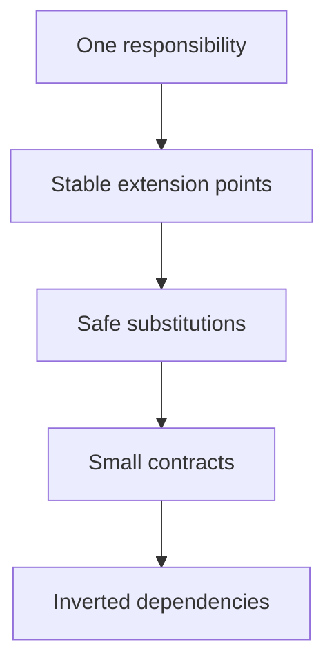

# SOLID Principles — Practical Design Rules

SOLID is a set of design guidelines, not a requirement to create an interface for every class. Start with a clear design and introduce an abstraction when there is a real variation, dependency, or reason to change.



Every example in [`examples/solid/`](../examples/solid/) contains an intentionally problematic design and a more maintainable alternative.

## The five principles

| Principle | Meaning | Design smell | Example |
|---|---|---|---|
| **SRP** — Single Responsibility | A unit has one cohesive reason to change. | Report rules and report formatting are tangled. | [`01_srp.py`](../examples/solid/01_srp.py) |
| **OCP** — Open/Closed | Extend behavior through a stable contract. | An `if/elif` chain grows for every new type. | [`02_ocp.py`](../examples/solid/02_ocp.py) |
| **LSP** — Liskov Substitution | A subtype preserves the base contract. | A subtype rejects an operation promised by its parent. | [`03_lsp.py`](../examples/solid/03_lsp.py) |
| **ISP** — Interface Segregation | Consumers depend only on what they use. | A read-only client must implement writing. | [`04_isp.py`](../examples/solid/04_isp.py) |
| **DIP** — Dependency Inversion | High-level policy depends on abstractions. | A service constructs a concrete storage class internally. | [`05_dip.py`](../examples/solid/05_dip.py) |

## S — Single Responsibility Principle

SRP does not mean “one method per class.” It means the responsibilities inside a unit are cohesive and share a reason to change.

If a report class calculates totals and formats terminal output, two unrelated changes can force edits to the same class. Separate the calculation policy from the presentation policy.

Ask:

> Who or what could request a change to this code?

If different stakeholders or concerns can change different parts, the unit may contain multiple responsibilities.

## O — Open/Closed Principle

A stable consumer should not require modification every time a new variation is introduced.

In the first checkout design, adding a discount requires editing a growing conditional. In the improved design, every discount implements `apply`, and checkout uses the contract.

Adding `FixedDiscount` changes the composition or wiring at startup, not the checkout algorithm itself. OCP does not prohibit fixing bugs or responding to changed requirements; it protects a known variation point from unnecessary edits.

## L — Liskov Substitution Principle

Inheritance is safe only when the subtype preserves the expectations of the base type.

The subtype should not:

- strengthen preconditions unexpectedly;
- weaken postconditions;
- violate important invariants;
- change the meaning of a promised operation.

A classic example is a base `Bird` contract that promises `fly()`, followed by a `Penguin` subtype that throws an exception. The design promised too much in the base abstraction. A better model separates `FlyingBird` from birds in general.

An exception is not automatically an LSP violation. It depends on what the original contract explicitly permits.

## I — Interface Segregation Principle

Clients should not depend on methods they do not need.

Instead of one large read/write interface, define focused contracts such as `Reader` and `Writer`. A display component that only reads data can then work with a read-only source without implementing a fake `write` method.

ISP is about the size and shape of a contract from the consumer's perspective. SRP is about the reasons a unit changes.

## D — Dependency Inversion Principle

High-level policy should not depend directly on low-level implementation details. Both should depend on an abstraction.

`ReportService` should receive a `Reader` contract rather than constructing `MemoryReader` inside itself. The composition root chooses the concrete implementation.

```text
Composition root → concrete adapter → abstraction ← high-level service
```

Dependency Injection is a technique for supplying a dependency from outside. DIP is the design principle about the direction of dependency. Passing a concrete object alone does not guarantee a good abstraction.

In Python, `Protocol` can document the contract and support static analysis, while duck typing can provide the runtime flexibility.

## How to use SOLID without overengineering

1. Start with the simplest design that is correct.
2. Identify a real source of change or a difficult dependency.
3. Extract the smallest useful contract.
4. Keep the consumer independent from the concrete detail.
5. Add a test that protects the behavior.

Do not add abstractions only because a principle has a name. Add them when they make change, testing, or reasoning easier.

## Practice challenge

Run the examples in order. For each one:

1. Identify the line that would need to change when a new type is added.
2. Add a new type to the improved design.
3. Explain why the consumer did or did not need modification.
4. Describe the trade-off introduced by the abstraction.
